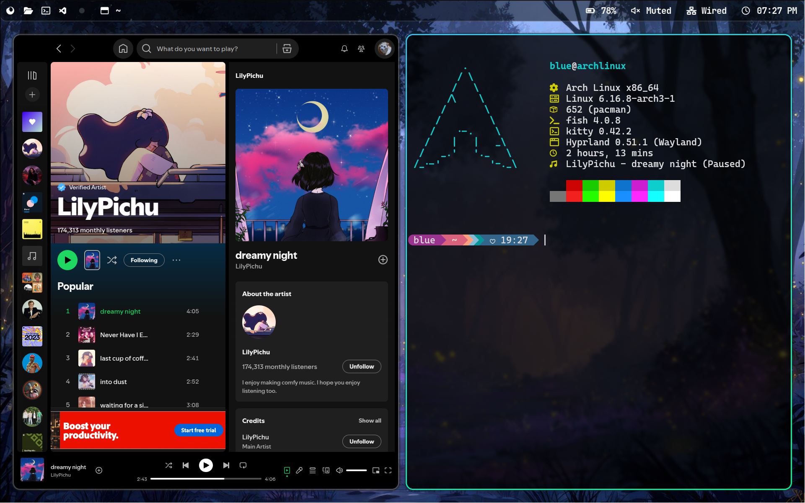

# 🚀 DeveloperJosh's Dotfiles

Welcome to my personal collection of configuration files! This repository contains the settings I use to create my productive and visually appealing development environment on Linux.



## 🖥️ What's Inside?

These dotfiles configure the following applications to work together seamlessly:

* **[Hyprland](https://hyprland.org/)**: A dynamic, tiling Wayland compositor known for its smooth animations and extensive customization options.
* **[Kitty](https://sw.kovidgoyal.net/kitty/)**: A fast, feature-rich, GPU-based terminal emulator.
* **[Waybar](https://github.com/Alexays/Waybar)**: A highly customizable status bar for Wayland compositors like Hyprland.
* **[Fastfetch](https://github.com/fastfetch-cli/fastfetch)**: A neofetch-like tool for fetching system information and displaying it in the terminal, but much faster.

## ⚙️ Installation

**Disclaimer:** These are my personal configuration files. You should inspect the `install.sh` script and understand what it does before running it. It's always a good idea to back up your own configuration files first.

1.  **Clone the repository:**
    ```bash
    git clone https://github.com/DeveloperJosh/dotfiles.git ~/.dotfiles
    ```

2.  **Run the Install Script:**
    Navigate into the directory, make the script executable, and run it. The script will automatically back up any existing configurations and create the necessary symbolic links.
    ```bash
    cd ~/.dotfiles
    chmod +x install.sh
    ./install.sh
    ```

3.  **Install Dependencies:**
    Ensure you have all the necessary applications, fonts (especially Nerd Fonts for icons), and any dependencies required by the scripts or Waybar modules.

## ✨ Customization

Feel free to fork this repository and customize the configurations to your heart's content. The files are well-commented where necessary to make tweaking them as easy as possible.